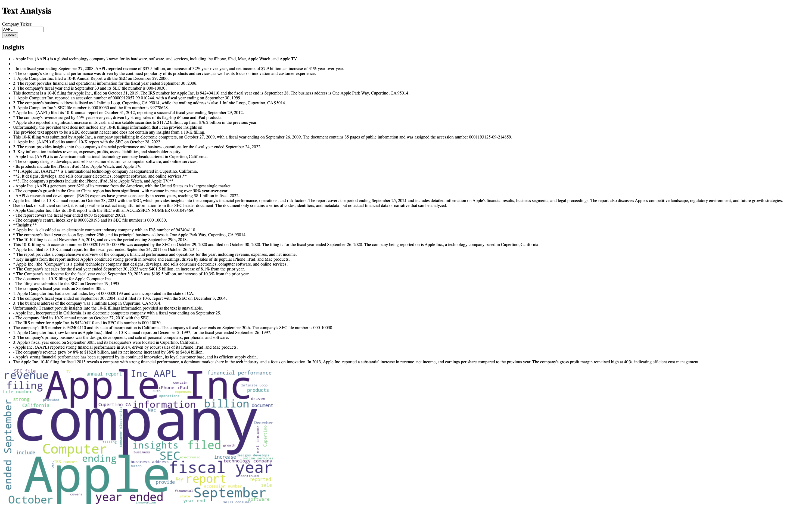
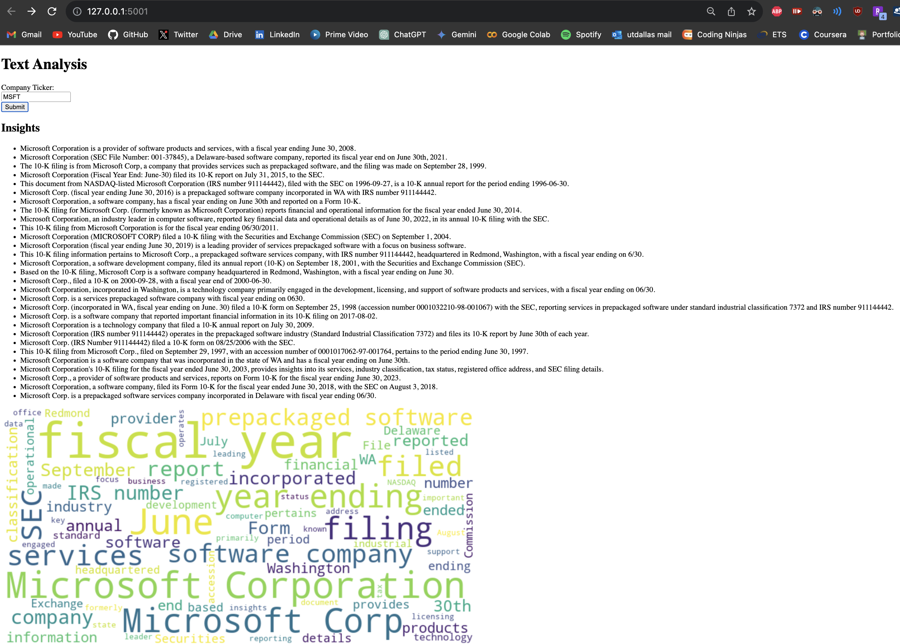
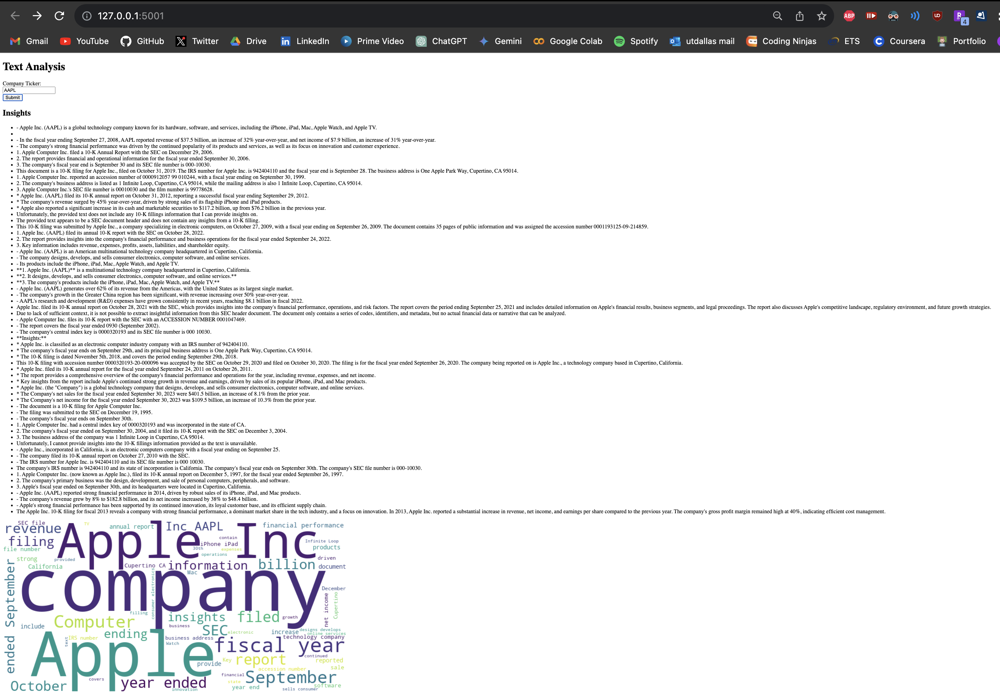
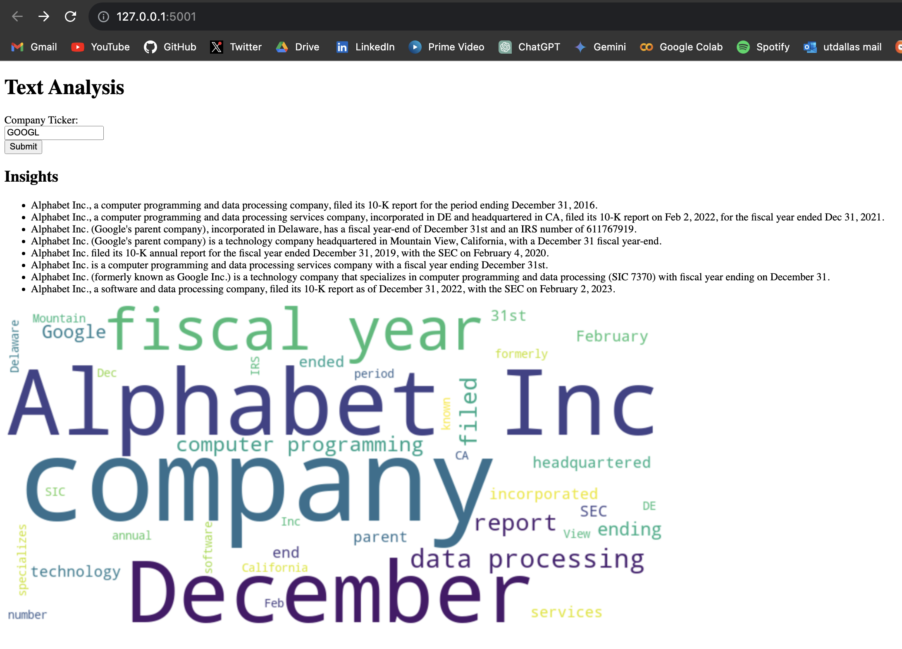
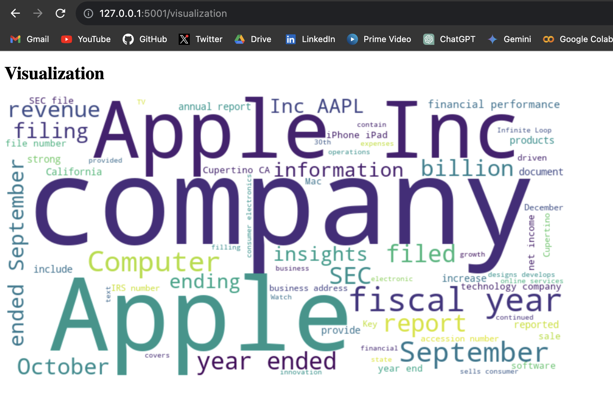

# 10-K Insights Generator (TEST the app on AAPL, GOOGL and MSFT tickers only)

Deployed on : [https://georgia-tech-takehome-assignment.onrender.com/] (loading might take a while as its a free service but it will work!)

This Flask web application extracts insights from 10-K filings of companies and generates a word cloud visualization of the extracted insights. The application uses Google's Generative AI for content generation and Flask for the web framework.

## Tech Stack
- **Flask**: Lightweight WSGI web application framework.
- **Pydantic**: Data validation and settings management using Python type annotations.
- **Requests**: HTTP library for sending requests.
- **Matplotlib**: Data visualization library for creating static, animated, and interactive visualizations.
- **Google Generative AI**: Used Gemini-pro API for text generation and content creation.
- **WordCloud**: Text visualization library for creating word clouds.
- **sec-edgar-downloader**: Python library for downloading company filings from the SEC's EDGAR database.

## RESULT SCREENSHOTS

